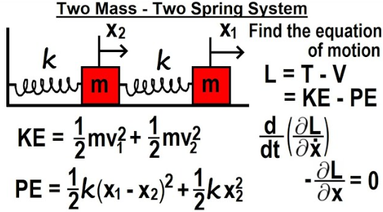
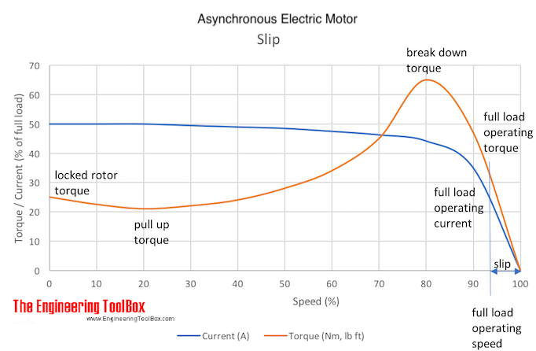

### SS01. Getting Started with SIMIT Siemens Simulation Platform with Servo Drive Motion Control (EN)

[SS01. Getting Started with SIMIT Siemens Simulation Platform with Servo Drive Motion Control (EN) - YouTube](https://www.youtube.com/watch?v=7gtcHlpGNSY)

###### Terminologies

oscillation -> movement back and forth in a regular rhythm.

resonance -> the quality in a sound of being deep, full, and [reverberating](https://www.google.com/search?sca_esv=7ef4f979cad443e4&biw=1920&bih=945&sxsrf=ADLYWILtRTpW03kErRZ23_E_Jb20jAirAQ:1726292006609&q=reverberating&si=ACC90nyj24cUGopiOVnGD91130XTHh_4bQKlNudNNPkYajq5FEMtOcQDDN00Sf89KG36Ey0Vbmwx5QjS1cZ9ePsrYX7zP8HKyB8CvgYQufSU7BLzpsf-V48%3D&expnd=1&sa=X&ved=2ahUKEwjtoNTu2sGIAxVYTGwGHRlwFv4QyecJegQIPRAO).

inertia -> a tendency to do nothing or to remain unchanged.

torque -> Torque is the *turning force through a radius*

two mass system -> 

###### Full load operating torque vs. break down, pull up and locked rotor torque

[Electrical Induction Motors - Torque vs. Speed](https://www.engineeringtoolbox.com/electrical-motors-torques-d_651.html)

###### SIMATIC VibX (VIBration eXtinction)

in this Load system, consider the momentary of inertia from the motor and load

consider the torque and speed of motor, as well as the oscillation frequency

